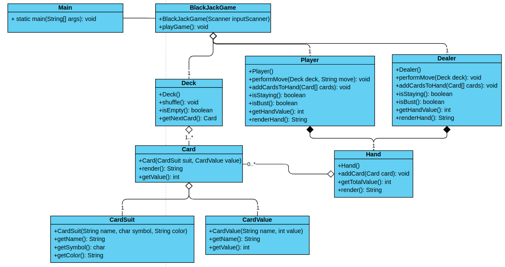
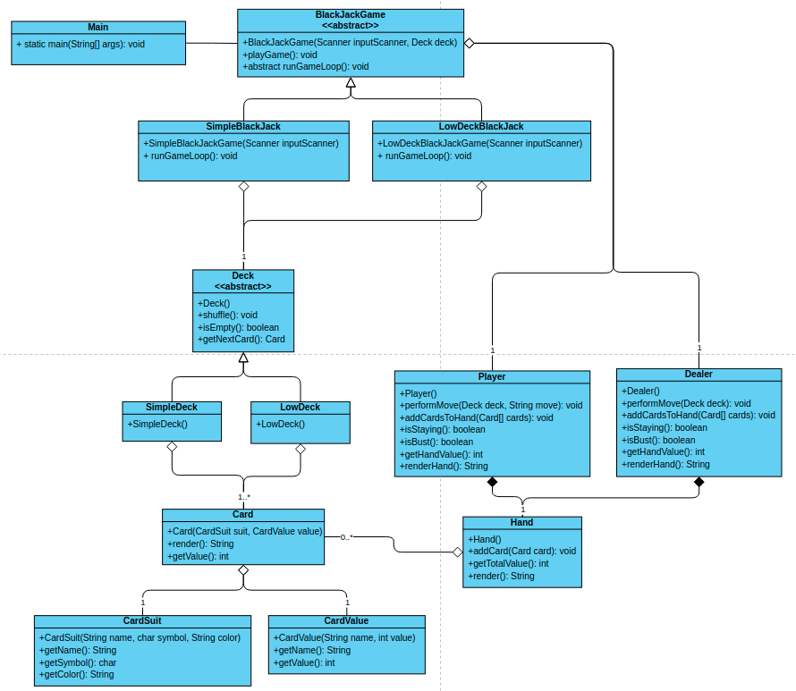

# Opdracht 3: Blackjack V1

Tijdens deze oefening ga je het spel Blackjack toevoegen aan de applicatie. Hierin zul je aanzienlijk meer klassen nodig
hebben die verschillende relaties met elkaar hebben. Kijk goed naar de stappen in het spelverloop en het klassendiagram
hieronder en maak de implementatie af.

### **Voorbereiding**

1. Heb je de vorige opdracht afgerond? Dan is dat ook meteen het startpunt van deze opdracht. Wanneer dit niet zo is kun
   je de code in de map ‘solution-1’ gebruiken als startpunt.
2. Maak een nieuwe map ‘blackjack_v1’ aan in de novi map en maak daarin alvast de klasse ‘BlackjackGame’ aan. Geef deze
   klasse dezelfde implementatie als de `HigherLower` start klasse waar je in opdracht 1 mee begonnen bent (zoals hij in
   de ‘start’ map te vinden is). Dit is een goed beginpunt.
3. Pas de ‘main’ methode in de Main klasse aan zodat er een instantie van ‘BlackjackGame’ wordt aangemaakt in plaats van
   ‘HigherLowerGame’.

### **Spelregels**

- Het spel begint met een set kaarten (deck), in deze variant spelen we zonder azen en zonder jokers. Dan zijn dus de
  kaarten 2, 3, 4, 5, 6, 7, 8, 9, 10, boer, vrouw en de koning.
- Iedere kaart heeft een waarde. Bij numerieke kaarten is dit de numerieke waarde, de boer, vrouw en koning zijn alle
  drie 10 punten waarden.
- Het spel wordt gespeeld tussen een ‘dealer’ (de applicatie) en een ‘player’ (de speler).
- Het doel is om zo dicht mogelijk bij (of exact op) 21 uit te komen in de waarde van de kaarten die de speler in zijn
  hand heeft. Gaat hij er overheen dan verliest hij.
- Bij aanvang van het spel krijgt de speler 2 kaarten, de dealer krijgt er 1.
- De speler kan dan kiezen voor een ‘stay’, hij trekt geen nieuwe kaart en hoopt dus dat de dealer over de 21 heen
  gaat (bust). Of de speler trekt een kaart (hit).
- De dealer doet daarna hetzelfde.
- Het spel eindigt wanneer de speler of de dealer over de 21 heen is gegaan of wanneer de speler of dealer heeft gekozen
  voor een ‘stay’ en de ander een hogere kaartwaarde (onder of gelijk aan 21) heeft bereikt.
- Bij een gelijke kaartwaarde in de eindsituatie wint de dealer altijd.

### **Spelverloop**

1. De speler start het spel
2. Het spel maakt een deck aan met daarin alle benodigde kaarten.
3. Het spel maakt de player en dealer objecten aan, beide met een lege ‘hand’
4. Het spel schudt de kaarten
5. Het spel geeft de player 2 kaarten van de stapel
6. Het spel geeft de dealer 1 kaart van de stapel
7. Keuze aan de speler: Hit or stay?
8. Indien hit: geef de speler een kaart van de stapel
9. Is de speler ‘bust’?

*De speler heeft verloren*

1. Keuze aan de dealer: Hit or stay?
2. Indien hit: geef de dealer een kaart van de stapel
3. Is de dealer ‘bust’?

*De speler heeft gewonnen*

1. Heeft de dealer gekozen voor een ‘stay’ en is de waarde van zijn hand < de waarde van de hand van de speler?

*De speler heeft gewonnen*

1. Heeft de speler gekozen voor een ‘stay’ en is de waarde van zijn hand <= de waarde van de hand van de dealer?

*De dealer heeft gewonnen*

1. Terug naar stap 6-12 (rekening houdende met de ‘stay’ status van de player en de dealer)

### **Klassendiagram**

### **Hints**

- De dealer zal gespeeld worden door de applicatie en zal dus zelf moeten beslissen of hij voor een ‘hit’ of een ‘stay’
  kiest. Voor de eenvoud kun je er voor kiezen om de dealer altijd voor een ‘hit’ te laten kiezen wanneer de waarde van
  zijn kaarten < 17 is. In alle andere gevallen kiest hij dan voor een ‘stay’.
- In het klassendiagram is af te lezen dat de `CardSuit` klasse een ‘symbol’ property heeft van het type char. In de
  unicode standaard zitten de vier verschillende iconen (ruiten, harten, klavers & schoppen) die wij hiervoor kunnen
  gebruiken. Hieronder vind je een voorbeeld waarin dit voor de vier ‘suits’ voor je is ingevuld.

# Opdracht 3: Blackjack V2

Tijdens deze oefening ga je het spel blackjack_v1 dat je in de vorige opdracht hebt gebouwd uitbreiden. Het doel is om het
spelen van verschillende varianten op blackjack_v2 mogelijk te maken zonder code te hoeven dupliceren. Om dat voor elkaar
te krijgen ga je gebruik maken van overerving en abstracte klassen.

Het spel moet twee varianten gaan ondersteunen: ‘SimpleBlackjack’ met kaarten en regels zoals je ze in de vorige
opdracht hebt opgezet, en een variant die we ‘LowDeckBlackjack’ noemen waarbij wordt gespeeld met een kaartendeck
bestaande uit alle kaarten met waardes tussen 2 en 6 uit drie losse decks.

Kijk goed naar het klassendiagram om de bestaande blackjack_v2 applicatie zo aan te passen dat beide spellen speelbaar
zijn (na aanpassen van de ‘main’ methode).

## Klassendiagram

## Klassendiagram

