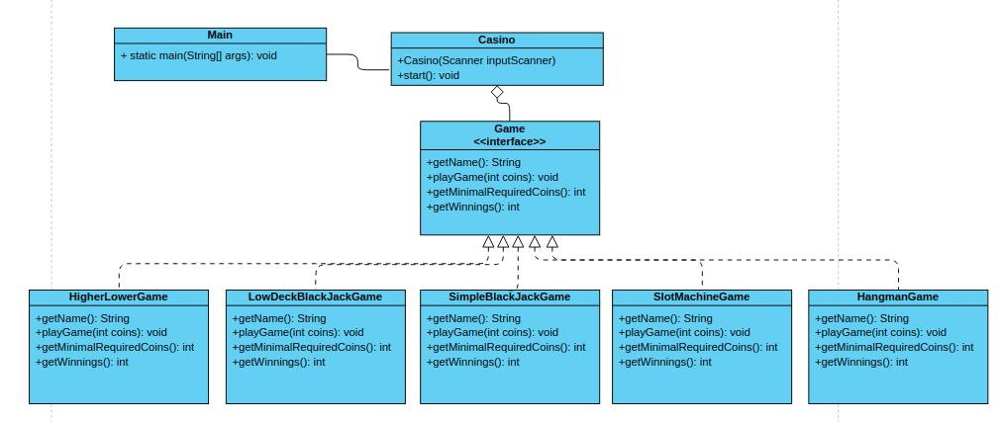

# **Opdracht Casino de Gouden Driehoek: Interfaces**

In deze oefening, die om interfaces draait, ga je alle spellen samenvoegen zodat je ze allemaal kunt spelen zonder dat je steeds je code hoeft aan te passen. Je gaat daarnaast ook een muntensysteem aan alle spellen toevoegen zodat het wat meer op een casino lijkt.

### **Voorbereiding**

1. Heb je de vorige opdracht afgerond? Dan is dat ook meteen het startpunt van deze opdracht. Wanneer dit niet zo is kun je de code in de map ‘solution-5’ gebruiken als startpunt.

### **Stappenplan**

1. Maak een interface ‘Game’ aan in de novi map en definieer daarin de methodes die je in het klassendiagram terugziet.
2. Zorg er voor dat alle ‘game’ klassen die je in de vorige opdrachten hebt aangemaakt deze interface op de juiste manier implementeren.
3. Maak een ‘Casino’ klasse aan in de novi map en pas de main methode aan zodat er een object van deze klasse wordt aangemaakt en de ‘start’ methode wordt aangeroepen.
4. Zorg er voor dat de ‘casino’ klasse de hieronder beschreven logica bevat.

### **De Casino klasse**

1. Wanneer de speler de applicatie start ziet hij een welkomstbericht
2. De speler krijgt 1000 munten om mee te spelen
3. De speler kan kiezen om een spel te spelen (door de letter ‘p’ in te typen) of om het spel af te sluiten met de letter ‘q’.
4. Kiest hij voor spelen dan krijgt hij een overzicht van de spellen die hij kan spelen. Dit zijn enkel de spellen waar hij op dat moment nog genoeg munten voor heeft.
5. De speler kiest een spel
6. De speler speelt het spel
7. Na afloop wordt de winst (of verlies) van de speler opgehaald bij het spel, deze wordt opgeteld bij het totaal aantal munten van de speler. Het resultaat en de huidige muntenvoorraad wordt aan de speler getoond.
8. Terug naar stap 3

### **Klassendiagram**
