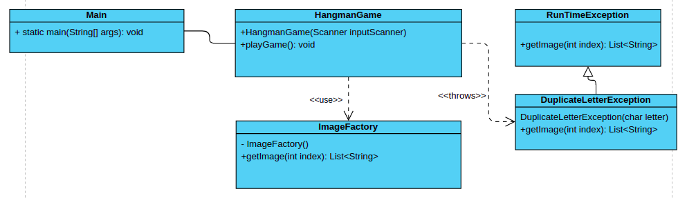

# **Opdracht Casino de Gouden Driehoek: Static methods & overloading**

In deze oefening ga je het spel ‘galgje’ toevoegen aan de applicatie. Hierbij zul je gebruik maken van een klasse met een statische methode voor het tonen van de juiste afbeeldingen.

### **Voorbereiding**

1. Heb je de vorige opdracht afgerond? Dan is dat ook meteen het startpunt van deze opdracht. Wanneer dit niet zo is kun je de code in de map ‘solution-4’ gebruiken als startpunt.
2. Maak een nieuwe map hangman aan in de novi map en maak daarin alvast de klasse HangmanGame aan. Geef deze klasse dezelfde implementatie als de `HigherLower` start klasse waar je in opdracht 1 mee begonnen bent (zoals hij in de ‘start’ map te vinden is). Dit is een goed beginpunt.
3. Pas de ‘main’ methode in de Main klasse aan zodat er een instantie van HangmanGame wordt aangemaakt en gestart.

### **Spelverloop**

1. De speler start het spel
2. Het spel kiest een willekeurig woord uit een statische lijst van woorden.
3. Het spel toont het woord in * tekens om het aantal letters te laten zien
4. Het spel toont de tekst: ‘Vul een letter in’
5. De gebruiker vult een letter in
6. Heeft de speler de letter al gebruikt?

Zo nee: ga naar stap 7

Zo ja: Gooi een ‘DuplicateLetterException’ en print het bericht, terug naar stap 4

1. Voeg de letter toe aan de letters die al gebruikt zijn
2. Zit de letter in het te raden woord?

Zo ja: toon het woord in * tekens waarin je de geraden letters wel laat zien

Zo nee: hoog het aantal foutieve beurten op met 1 en toon de juiste afbeelding van de galg

1. Zijn alle letters geraden? De speler heeft gewonnen
2. Heeft de speler 8 foutieve beurten? De speler heeft verloren
3. In alle andere gevallen: terug naar stap 4

### **De ImageFactory klasse**

1. Maak een klasse ‘ImageFactory’ aan in de hangman map. Deze klasse zal de 8 ‘hangman’ afbeeldingen bevatten (een leeg canvas, de voet, de voet en de paal etc.)
2. Geef de klasse een statische variabele IMAGES van het type String[][] en vul deze met de 8 ‘hangman’ afbeeldingen (een voorbeeld van de afbeeldingen is te vinden in de ‘examples’ map. Iedere afbeelding bestaat uit meerdere strings die (wanneer je ze regel voor regel print in de terminal) de afbeelding vormen.
3. De klasse heeft een statische methode ‘getImage’ met als parameter een int (het aantal foutieve beurten). Geef daarmee de juiste afbeelding terug uit de array van afbeeldingen.

### **Klassendiagram**

