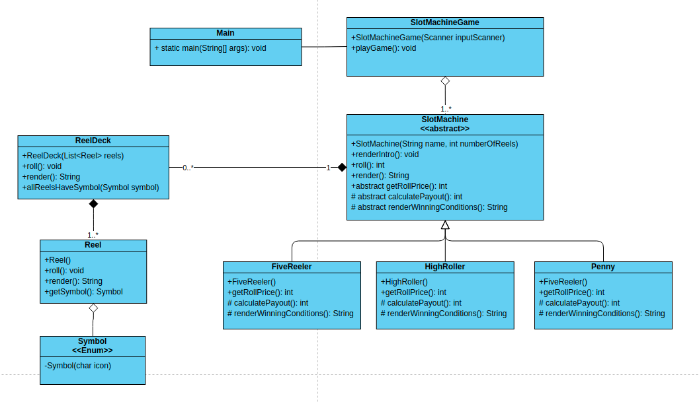

# **Opdracht Casino de Gouden Driehoek: Scope, access modifiers & keywords**

Deze opdracht staat in het teken van scope, access modifiers en keywords, maar eigenlijk komen ook alle concepten uit de vorige opdracht nog eens terug. Je gaat wederom een spel toevoegen aan de applicatie, dit keer een casino klassieker: fruitautomaten.

Het spel zal bestaan uit drie verschillende fruitautomaten met verschillende instellingen. Bij het starten van het spel krijgt de speler een hoeveelheid munten, die kan hij gebruiken om bij één van de drie automaten te spelen.

In deze applicatie zul je zowel private, public als protected methodes gaan schrijven. Probeer zelf ook gebruik te maken van de verschillende keywords die Java kent.

## **Voorbereiding**

1. Heb je de vorige opdracht afgerond? Dan is dat ook meteen het startpunt van deze opdracht. Wanneer dit niet zo is kun je de code in de map ‘solution-3’ gebruiken als startpunt.
2. Maak een nieuwe map slotmachines aan in de novi map en maak daarin alvast de klasse SlotMachineGame aan. Geef deze klasse dezelfde implementatie als de `HigherLower` start klasse waar je in opdracht 1 mee begonnen bent (zoals hij in de ‘start’ map te vinden is). Dit is een goed beginpunt.
3. Pas de ‘main’ methode in de Main klasse aan zodat er een instantie van SlotMachineGame wordt aangemaakt en gestart.
4. De wielen van de fruitautomaten moeten uiteraard iconen hebben, hiervoor kun je (net als bij Blackjack) unicode iconen gebruiken. In de ‘examples’ map van het Github project staat een voorgedefinieerde klasse Symbol met daarin een aantal standaard iconen die je kunt gebruiken. Je kan uiteraard ook zelf wat Unicode iconen opzoeken (let er dan wel op dat ze niet allemaal in iedere terminal ondersteund worden).

## **De machines**

Het spel zal 3 machines gaan ondersteunen:

- De ‘Penny Machine’ heeft 3 wielen en ieder spel kost 1 munt. De speler wint enkel als alle wielen hetzelfde icoon tonen waarbij de winst afhankelijk is van het icoon. Je mag hier zelf de te winnen munten bij bedenken.
- De ‘High Roller machine’ is identiek aan de ‘Penny Machine’ alleen kost ieder spel 10 munten. De te winnen prijzen liggen uiteraard ook een stuk hoger, ook die mag je zelf bepalen.
- De ‘5-reeler’ machine heeft, zoals de naam al aangeeft, 5 wielen in plaats van 3. Een spel op de machine kost 5 munten. De prijzen mag je wederom zelf bedenken.

## **Spelverloop**

1. De speler start het spel
2. De speler krijgt 100 munten om mee te spelen
3. Vraag aan de speler: op welke machine wil je spelen?
4. Penny machine, High Roller machine of 5-reeler machine?
5. Heeft de speler genoeg munten om op de machine te spelen?
    1. Zo ja: ga naar stap 5
    2. Zo nee: ga terug naar stap 3
6. Start het spel op de machine
7. Trek aan de digitale hendel van de machine
8. Bereken de behaalde winst - de inleg en tel dit op bij het aantal munten van de speler
9. Heeft de speler genoeg munten om nog een keer te spelen?
    1. Zo ja: ga naar stap 10
    2. Zo nee: spel eindigt
10. Vraag aan de speler: wil je nog een keer spelen?
    1. Zo ja: ga terug naar stap 5
    2. Zo nee: spel eindigt

## **Klassendiagram**

